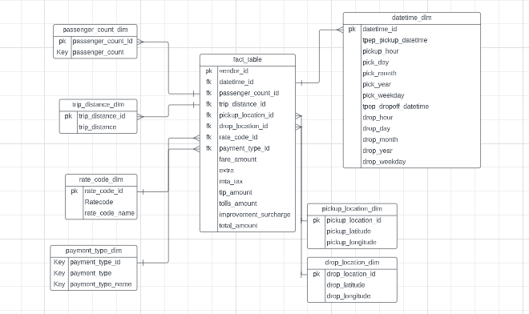

# Introduction

In this project, our main objective is to work with a dataset similar to Uber's and perform various data engineering tasks. We will build a data model using a fact and dimension format on and write transformation code using Python. To deploy our code, we will utilize a compute instance on Google Cloud and leverage an open-source data pipeline tool called Mage.

The data will be loaded into BigQuery, which acts as our data warehouse. Furthermore, we will create a final dashboard using LookerStudio, a powerful business intelligence tool. This dashboard will provide visual representations and insights based on the processed data.

Additionally, it explores the various Google Cloud Platform (GCP) services that will be utilized throughout the project, such as Google Cloud storage, compute engine, and BigQuery.

# Technology Used
<ul style="list-style-type: none;">
  <li style="margin-bottom: 5px;">
    
    Programming Language: Python
  </li>
</ul>

    
Google Cloud Platform

1. Google Storage
2. Compute Instance
3. BigQuery
4. Looker Studio
   
Modern Data Pipeine Tool - [ Mage](https://www.mage.ai/)

# Data Modeling 

As the project execution begins, the first step involves data modeling and understanding the dataset and its corresponding data dictionary. This step is crucial for designing an effective data model that aligns with the project's objectives.

To transform the flat hierarchy table into a structured format, an online tool called Lucidchart is utilized. Using Lucidchart, the data frame is transformed into fact and dimension tables. Multiple dimension tables are created based on the information that would have been in the fact tables, facilitating a more realistic understanding and visualization of the data.

The dimension model can be enhanced by adding more columns, extracting additional information, and gaining a deeper understanding of the dataset, depending on the project requirements. For example, details like pick-up day, pick-up month, and pick-up weekday can be incorporated.

The date-time dimension table serves as the primary key, while the passenger account and trip distance are transactional values that change over time. These values are placed in different dimension tables to explore the workings of actual joins.

Similarly, dimension tables are created for pick-up location, pick-up location ID, drop location, drop location ID, rate code, and payment type. These tables include primary keys, foreign keys, and relevant columns to accurately represent associated information.

# Writing Transformation Code(Python)

During the project's transformation code phase in Python, the main objective is to convert the flat file into a dimension model using structured programming code. This process involves dropping duplicates, resetting the index, and assigning unique values to the date-time column.Once the flat file is successfully converted into dimension tables, the subsequent task is to create the fact table by merging the dimension tables.

Upon completing the transformation code, the data can be uploaded to Google Cloud storage for deployment. Analyzing the data, executing queries, and developing a dashboard follow as subsequent steps in the project.

# Google Cloud Storage & Mage Installation

On Google Cloud console, we create buckets for storing our dataset. 

For Mage installation, we start by creating a compute engine instance on Google Cloud. Configure the instance with appropriate CPU and memory specifications. we then connect to the instance and install the necessary packages, such as Python and pandas.

To install Mage, we use either 'Docker' or 'Pip'. In our case, we use 'pip', and the installation commands can be executed in the virtual machine. Once Mage is installed, we start a project by running 'mage start project_name'.

To enable access to the instance, we create a firewall rule to allow requests from port 6789 and specifiying IP address. This will enable accessing the user interface (UI) of the instance.

Within the Mage project, to load data, we provide the API name to extract data from our bucket which contains dataset. Using pandas data frames and transformation blocks, we then transform the data according to the desired data model. The code is later run, and the results, including the created fact table, are verified.

By running the exporter code, we load the data into BigQuery using ymal file and create a table based on the provided name and configuration. We can then preview the data set and tables in BigQuery. This way, the ETL task is completed. 

# BigQuery Data Analysis

In BigQuery, analytical queries can be performed using SQL commands on the fact table, such as 'CLICK HERE'.

In this phase of the project, we select columns from multiple tables to extract data to create visualization. 

# Building Dashboards

Once the BigQuery is connected, the data set can be added to the report. The dashboard can be customized by adding text, filters, and different sections for filtering data by VendorID, payment type, rate code and trip distance. Also, the dashboard is created to display metrics such as total revenue, record count, average trip distance, average fare amount and average tip amount, which can be used to make informed decisions. Calculated fields are used to show maps of pickup locations highlighting vendor ID and rate code names. Additionally, charts such as bar charts are used to visualize the average amount by rate code, average amount by payment type, pie charts for rate code and vendor ID . The dashboard provides insights and allows for exploration of data by manipulating columns and visualizations.

